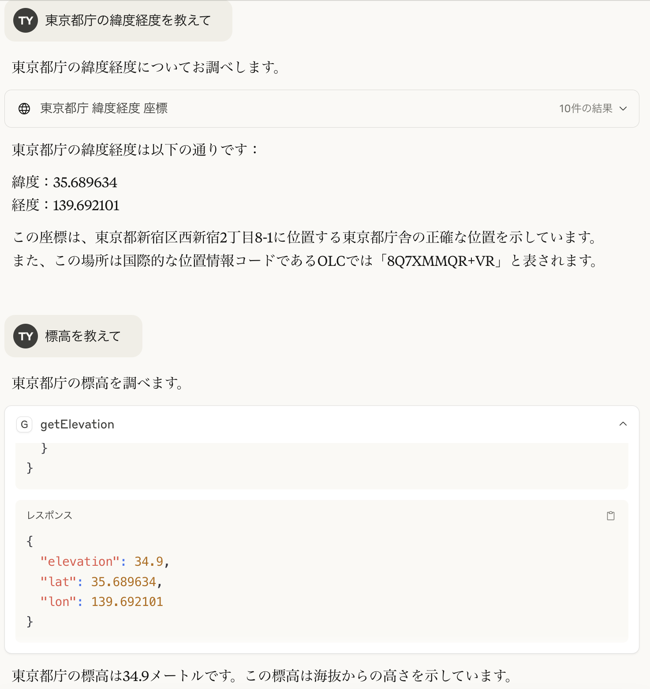

# Geo MCP Server

A minimal MCP server that provides tools such as `getElevation` to interact with geographical data.
For retrieving elevation data based on latitude and longitude, it utilizes the [Geospatial Information Authority of Japan API](https://maps.gsi.go.jp/development/elevation_s.html).

## Configuration for Claude Desktop

Add this server under the `mcpServers` key of Claude Desktop configuration.
See the [official document of the Model Context Protocol](https://modelcontextprotocol.io/quickstart/user) for details.

```json
{
   "mcpServers": {
      "geo": {
         "command": "npx",
         "args": [
            "https://github.com/toshihikoyanase/geo-mcp-server.git"
         ]
      }
   }
}
```

### Example Usage: Retrieving Elevation for Tokyo Metropolitan Government Office

Below is an example of how to use the Geo MCP Server to find the elevation based on the latitude and longitude of the Tokyo Metropolitan Government Office.



## Configuration for VS Code Copilot Agent

Add this server under the `servers` key in your MCP configuration for VS Code.
For example, to enable the MCP server in your workspace, create a `.vscode/mcp.json` file as follows:

```json
{
    "servers": {
        "geo": {
            "type": "stdio",
            "command": "npx",
            "args": [
                "https://github.com/toshihikoyanase/geo-mcp-server.git",
            ]
        }
    }
}
```


## API

### Tool: `getElevation`

**Description**: Fetches elevation data for a given latitude and longitude.

**Input**:
- `lat` (number): Latitude of the location.
- `lon` (number): Longitude of the location.

**Output**:
- Returns the elevation in meters for the specified coordinates.

## Development

## Setup

1. Clone this repository:
   ```bash
   git clone git@github.com:toshihikoyanase/geo-mcp-server.git
   cd geo-mcp-server
   ```
2. Install dependencies:
   ```bash
   npm install
   ```
3. Build the project:
   ```bash
   npm run build
   ```

## Usage

Run the server:

```bash
npm start
```

The server will run using standard input/output (stdio).


## License

This project is licensed under the MIT License. See the [LICENSE](LICENSE) file for details.


## Acknowledgments

This software leverages the Elevation API provided by the [Geospatial Information Authority of Japan (GSI)](https://maps.gsi.go.jp/development/elevation_s.html).

We appreciate GSI’s efforts in maintaining this service. Please ensure your own use of the API complies with GSI’s [terms of use](https://maps.gsi.go.jp/development/elevation_s.html#attention) and handle the data responsibly.